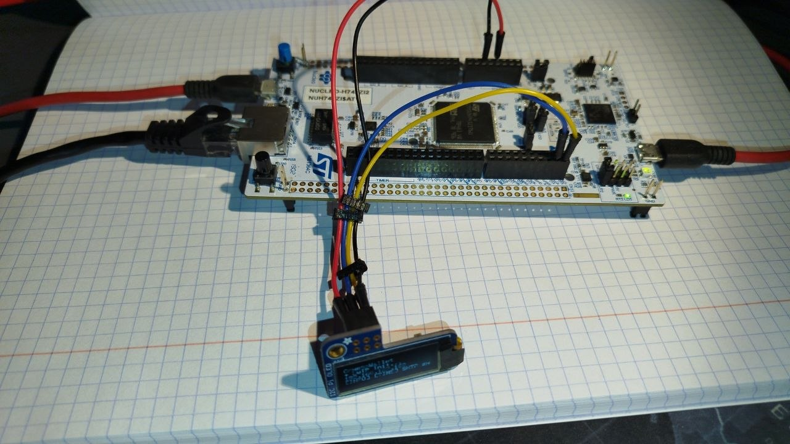

# CryptoWallet — dokumentacja

Jednolity kanon techniczny (oryginał angielski: [`../../README.md`](../../README.md)). Oprogramowanie układowe jest traktowane jako **jeden system**: granice zaufania, powierzchnie ataku, kryptografia, weryfikacja i eksploatacja — ten sam poziom szczegółów.

**Tłumaczenie:** ten katalog zawiera wersję polską; identyfikatory (nazwy funkcji, flagi kompilacji, ścieżki plików) pozostają jak w angielskim tekście.

| # | Dokument | Zakres |
|---|----------|--------|
| 1 | [01-trust-model-and-architecture.md](01-trust-model-and-architecture.md) | Łańcuch bootowania, granice zaufania, model zagrożeń, powiązania komponentów |
| 2 | [02-firmware-structure.md](02-firmware-structure.md) | Zadania, IPC, pamięć, mapa modułów → pliki źródłowe |
| 3 | [03-cryptography-and-signing.md](03-cryptography-and-signing.md) | Klucze, trezor-crypto, podpis, TRNG vs przyszłe przechowywanie powiązane z płytą |
| 4 | [04-http-and-webusb.md](04-http-and-webusb.md) | HTTP Ethernet, WebUSB, co **nie** jest uwierzytelnione |
| 5 | [05-uart-cwup-protocol.md](05-uart-cwup-protocol.md) | CWUP-0.1: fazy, polecenia, tryby RNG, status implementacji |
| 6 | [06-integrity-rng-verification.md](06-integrity-rng-verification.md) | `fw_integrity`, przechwytywanie TRNG UART, testy hosta, dieharder, CI |
| 7 | [07-build-ci-infrastructure.md](07-build-ci-infrastructure.md) | Flagi kompilacji, repozytoria sąsiednie / `CRYPTO_DEPS_ROOT`, Gitea, kontenery |

**Generowane (nie edytować ręcznie):**

- `generated/reference-code.md` — z `@file` / `@brief` w źródłach (`make docs-code-md`)
- `generated/testing-plan-signing-rng.md` — z `scripts/test_plan_signing_rng.py`

**Narzędzia:** [MAINTENANCE.md](MAINTENANCE.md) — MkDocs, Doxygen, opcjonalnie HTML (`site/`).

**Wejście do repozytorium:** [../../../README.md](../../../README.md)
